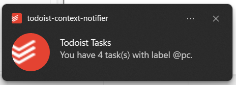

# Todoist Context Notifier

A lightweight Windows utility that checks your Todoist for tasks labeled with a computer-related context — like `@laptop`, `@desktop`, or `@pc`. If any matching tasks are found, it shows a Windows notification to remind you as soon as you log into your computer. Designed to integrate with Windows Task Scheduler for automatic execution on login.



## ✨ Features

- 🔍 Checks your Todoist for tasks with a specific label
- 🔔 Displays a Windows notification with the task count
- 🔗 Clicking the notification opens the filtered task list in your browser
- ⚙️ Includes a script to configure Windows Task Scheduler

## 🛠 Requirements

- Windows 10 or 11
- [.NET 7.0 Runtime](https://dotnet.microsoft.com/en-us/download/dotnet/7.0/runtime)
- A [Todoist account](https://todoist.com)
- Your Todoist API token
- Administrator privileges (required to set up Task Scheduler)

## 🚀 Getting Started

1.  **Download** the latest version from the [Releases](https://github.com/pfaustinopt/todoist-context-notifier/releases) page
2.  **Extract** the contents to a folder of your choice
3.  **Edit the included `appsettings.json` file** and replace the following values:

    ```json
    {
      "Todoist": {
        "ApiKey": "your-api-key-here",
        "Label": "your-label-here"
      }
    }
    ```

    **`ApiKey`:**

    - Go to [Todoist Developer Settings](https://app.todoist.com/app/settings/integrations/developer)
    - Copy your personal API token and paste it here

    **`Label`:**

    - This is the name of the label you use to identify computer-related tasks
    - Example: `"Label": "laptop"` (no `@` symbol)

### ▶️ Test the app manually
Before setting up Task Scheduler, you can test the app manually to make sure everything is working correctly:
1. Open the folder where you extracted the files.
2. Double-click `todoist-context-notifier.exe` to run the app.
3. If your `appsettings.json` is configured correctly:
   - A Windows notification should appear showing the number of matching Todoist tasks.
   - Clicking the notification will open your browser with the filtered task list.
4. If nothing happens or you see an error, double-check:
   - Your ApiKey is correct (from Todoist developer settings).
   - The Label matches an existing label (no @ symbol).
   - You have tasks in Todoist with that label.

Once confirmed, proceed to set it up to run automatically using Task Scheduler.

### 📅 Run at logon using Task Scheduler

To run the app automatically every time you log into Windows, **execute `create-task.bat`**. This script will:

- Prompts for admin permissions (required to register the task in Windows Task Scheduler)
- Register a scheduled task named "Todoist context notifier"
